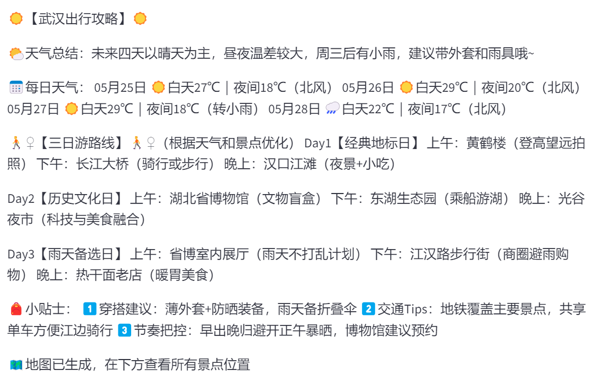
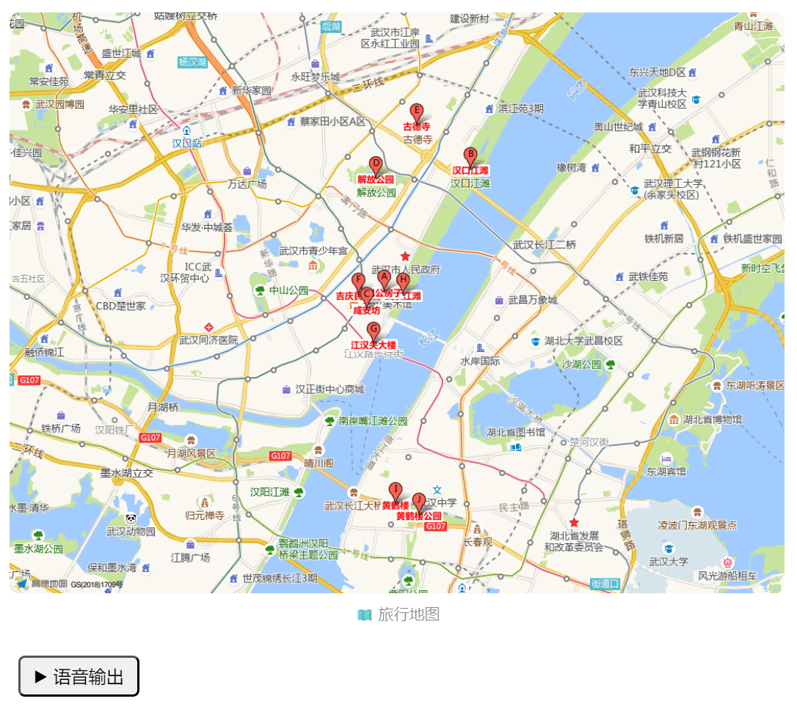

# 🛫 旅图通-你的旅游规划智能体

## 项目概述

随着人们生活节奏的加快与生活水平的提高，旅行已逐渐成为放松心情、拓展视野和提升生活质量的重要方式。然而，在旅行前期的规划过程中，用户常常面临信息分散、决策困难、时间紧迫等问题。如何根据个体需求快速获取准确、个性化的旅行方案，成为智能旅游服务亟待解决的核心痛点。

本项目旨在打造一个基于多模态交互的智能旅行规划助手。用户可通过语音输入、文件上传或文本描述三种方式，自由表达自己的旅行偏好与需求，如目的地、出行天数等。系统集成了天气查询、景点推荐、地理定位等多种能力，能够自动识别用户意图，获取目标城市的实时天气信息和热门景点，并结合地理位置生成一张路径点图，最终形成一份完整、个性化的旅游攻略。

项目演示视频：https://www.bilibili.com/video/BV1hzjuzvEEA/?vd_source=09580a941e482ad7383ba865f02c5415#reply263753245312

## 功能介绍

用户可以通过语音输入、文件上传或文本描述三种方式，与智能体进行交互。

- 语音输入：


- 上传文件：


- 文本输入：


智能体会根据用户输入调用各种工具，最后生成如下输出，包括天气、旅游路线、注意事项等：



智能体会给出路径点地图，用户可以选择语音输出旅行规划：



## 项目亮点

- 端到端的智能化旅行体验闭环——从用户语音 → 文本转录 → LLM理解 → 工具调用（天气/景点/地图） → 攻略生成，形成完整流程，具备高度自动化，降低了用户制定旅行计划的门槛。
- 多模态交互方式，用户有三种可选输入方式，智能体可以语音输出，也可以文本输出。体现了良好的用户适配性，满足不同情境下的使用需求。
- 景点地图自动生成，极具直观性。
- 天气预报+贴心提示，内容更生活化。
- 工具模块解耦，所有mcp tool都集成在tool_hub.py文件中，可扩展性强
- 使用 NVIDIA 多模态大模型，结合语音能力与问答能力，保障了整个智能体对话质量

## 技术细节

项目以NVIDIA NIM平台提供的llama-3.1-nemotron-ultra-253b-v1模型为核心，实现了客户端和服务端两个部分，分别对应mcp_main.py文件和tool_hub.py文件

### 客户端构建说明：

本项目客户端基于 **Streamlit** 实现，负责与用户交互，并调用后端 LLM 和工具服务生成旅行攻略。

#### 1. 多输入方式支持

通过 `radio` 实现三种输入：

- 语音输入：使用 `audiorecorder` 录音，保存为 WAV 格式。
- 文件上传：支持上传已有音频文件。
- 文本输入：直接输入城市名称或需求。

#### 2. 音频转文本处理

音频转文字调用 NVIDIA API（如 `microsoft/phi-4-multimodal-instruct`）：

- 音频内容转 base64 编码后嵌入 HTML `<audio>` 标签；
- 使用 HTTP POST 请求调用多模态模型完成识别。

#### 3. 与 LLM 和工具通信（Bridge 构建）

通过 MCP 提供的 `BridgeManager` 实现：

- 使用 `StdioServerParameters` 启动工具服务；
- 设置 `LLMConfig` 指定模型和 API；
- 使用 `system_prompt` 指导大模型生成内容并调用工具；
- 通过 `bridge.process_message()` 调用大模型智能体。

#### 4. 输出展示

- 展示识别文本、攻略内容；
- 如果生成了地图则显示静态地图图像；
- 使用浏览器原生 TTS 实现语音播报（SpeechSynthesis）。

### 服务端构建说明

该模块是基于 `FastMCP` 构建的工具服务端，提供天气查询和景点地图生成两个工具接口，供大模型调用。

#### 1. `weather_search(city: str)`

功能：调用高德天气 API，获取指定城市的未来天气预报。

实现细节：

- 使用 `httpx.AsyncClient` 进行异步请求；
- 提取日期、天气、气温、风力等信息，格式化返回；
- 支持 3-4 天的未来预报。

------

#### 2. `generate_static_map(city: str, keyword: str = "著名景点")`

功能：查询城市著名景点，并生成静态地图图像。

实现流程：

- 调用 `fetch_landmarks()` 查询城市景点坐标信息（最多10个）；
- 自动计算景点中心点，生成静态地图标注；
- 调用高德地图静态 API，保存为 `landmarks_map.png`；
- 同时保存景点数据到 `landmarks.json`。

------

#### 3. `fetch_landmarks(city, keyword)`

工具函数，用于从高德地图 API 获取景点位置数据，供地图生成函数使用。

## 配置教程

克隆本仓库后，执行下述指令安装所需要的依赖：

```bash
conda create -n mcp python=3.12
conda activate mcp
pip install -r requirements.txt
pip install streamlit streamlit-audiorecorder emoji
```

然后运行部署脚本：

```bash
sh setup.sh
```

通过下述指令启动服务：

```bash
streamlit run mcp_main.py
```

通过`http://localhost:8501`可以访问网页

## 团队贡献

- 谢宇翔：前端开发、代码统合、撰写文档、剪视频
- 刘楚航：天气查询、高德相关tool实现
- 张晓杰：语音转文字实现

## 未来展望

本项目未来可在多个方向进一步拓展与优化：功能上可引入交通规划、酒店餐饮推荐与用户偏好定制，实现更个性化的旅行服务；模型上可增强多轮对话能力与复杂指令理解，并支持更强语言模型接入；界面交互上可升级为支持地图缩放、图文混排、多语言输出的多模态体验；系统层面可构建标准 API 接口，实现平台化部署与插件式扩展，适应更多使用场景和应用需求。
